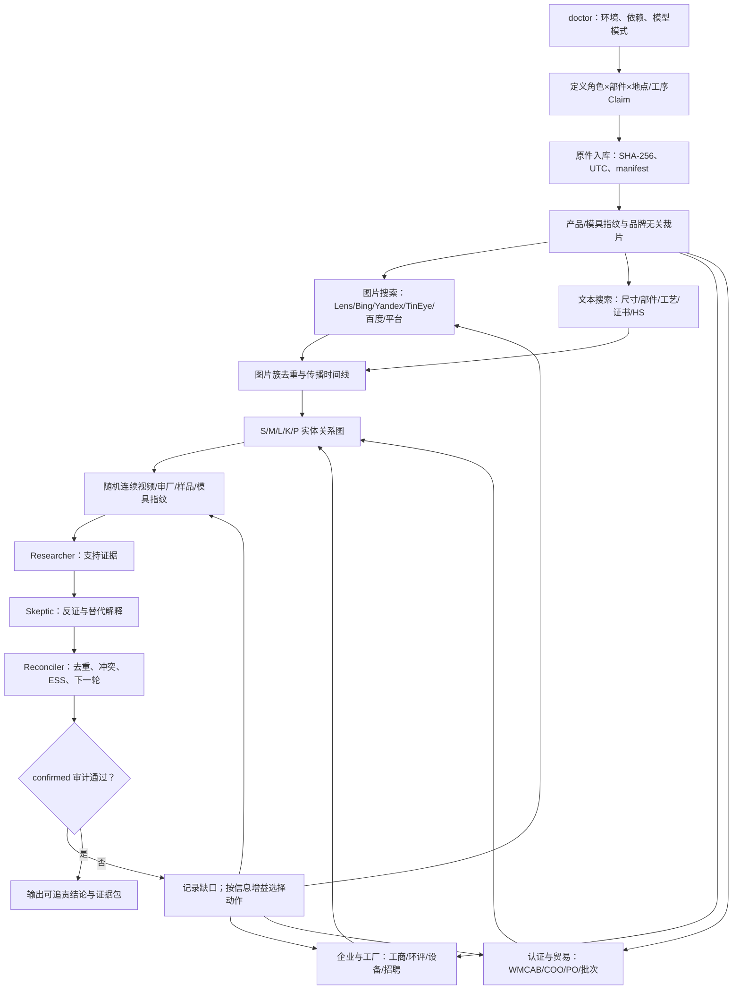

# Research workflow

## English

Run environment checks, define the product/site/process question, preserve originals, and create brand-neutral image variants. Split image/text search, corporate/site records, certification and trade documents into independent lanes. Merge image clusters and entity links, request process/batch evidence, then use Researcher, Skeptic and Reconciler rounds. Recompute assessments, lint reports and audit. If evidence is missing, select the next action by information gain and log what remains unknown. Do not take the shortcut same photo → shop → factory. The valid progression is visual lead → entity/site/process binding → exact SKU/batch → independent on-site/certification/commercial closure. Browser access failures are not evidence that a company lacks the item.

For ordered cross-platform commands, expected outputs and recovery actions, use [DEPLOY.md](../DEPLOY.md). The Chinese reference below retains the full method details; command names and schemas are language-independent.

## 中文详细参考

# 流程图

最常见的错误捷径：

`同款图 → 店铺 → 厂家`

正确链路：

`同款图 → 候选 → 法人/地址/工序 → 精确SKU/批次 → 独立现场/认证/贸易闭环`
